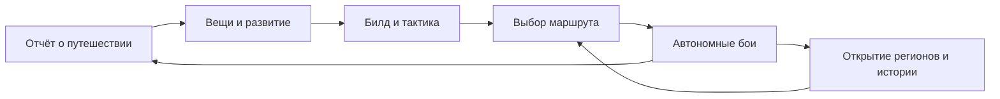

# 01. Замысел и игровой цикл

## Обещание игроку

**Ты не нажимаешь за героя. Ты делаешь так, чтобы он справлялся сам.**

ШОВЬ рассчитана на человека, которому нравятся RPG, подбор предметов и сравнение стратегий, но неудобны длинные обязательные сессии. Базовый ритм: 1-2 входа по 5-10 минут в день или один более обстоятельный вход раз в два дня. Недельное участие в клане занимает примерно 10-20 минут. Это целевые показатели удобства, а не ежедневная обязанность.

Ключевой навык игрока: прочитать проблему и изменить систему. Не хватает выживаемости против частых ударов? Переставить защитный навык, сменить условие его применения, пожертвовать частью взрывного урона. Нужен конкретный предмет? Отправиться в регион с подходящей таблицей добычи и собирать прогресс гарантированного получения.

## Мир

После события, известного как Разлом полудня, мир перестал быть непрерывным. Участки суши сохранили разные состояния: на одной улице идёт дождь, соседний квартал застыл в сухом летнем свете; металл помнит прежнюю форму, а деревья отбрасывают тени отсутствующих ветвей.

Жизнь продолжается. Люди строят мосты между участками, торгуют обычными товарами, спорят о том, какие места стоит восстановить. Герой работает проводником: исследует швы, устраняет опасные искажения и возвращает маршруты в общую карту.

Это не мир вечной тьмы. Опасность видна в красоте: звонкие сады, белые башни, красные луга и невероятно чистый свет. Восстановление меняет вид территории, но не удаляет её боевой вариант: пройденное место можно посещать как сохранённый отголосок.

Название «ШОВЬ» происходит от «шва» и звучит как название материала или страны. Латинское написание для рабочих идентификаторов: `shov`. Это пока не зарегистрированный бренд.

## Отличительные механики

| Механика | Как ощущается | Зачем нужна |
|---|---|---|
| Тактика из трёх условий | «Если готовится сильный удар, сначала защита» | Игрок управляет поведением без ручной игры в бою |
| Следы восстановления | Регион постепенно возвращает цвет, появляются жители | Прогресс виден за пределами числа силы |
| Два подхода к маршруту | Быстро пройти дальше или добывать конкретное снаряжение | Осмысленный выбор следующей автономной сессии |
| Мастерство снаряжения | Усиление остаётся в слоте при смене вещи | Находки и эксперименты сохраняют ценность |
| Атлас решений | В отчёте указаны причины поражения и вклад навыков | Обучение сборке билдов без таблиц вне игры |
| Клановые швы | Участники решают несколько задач общего недельного узла | Асинхронная кооперация, а не гонка присутствия |

## Основной цикл

Награды за прошедшее время зачисляются сервером автоматически при расчёте прогресса. Кнопка закрытия отчёта не выдаёт награду повторно и не является условием дальнейшего путешествия.

У героя всегда ровно один источник обычной добычи: активный маршрут. Просмотр рейтинга, примерка вещей, тренировочный бой или клановое испытание его не останавливают и не ускоряют.

## Два режима маршрута

**Продвижение.** Герой пытается пройти следующий открытый участок. После победы движется дальше по заранее выбранной области. Три поражения подряд переводят его на последнюю устойчивую точку фарма; попытки не исчезают, сложность сохраняется. После босса нового региона он останавливает продвижение на безопасном маршруте этого региона до выбора игрока, чтобы не пропустить сюжетные развилки.

**Добыча.** Герой повторяет выбранную открытую точку. Игрок выбирает цель из её таблицы: например, оружие для сборки на следах или основу конкретного рецепта. Выбор меняет профиль добычи в установленных пределах, но не создаёт дополнительный поток наград.

«Устойчивая точка» фиксируется после 10 последовательных побед данного билда, сохраняется в маршруте и пересматривается после его изменения. Если последняя точка стала непроходимой, герой отступает по уже открытым точкам до гарантированного стартового участка. Нулевого дохода из-за бесконечных поражений быть не должно.

Новые предметы не надеваются автоматически. Автовыбор менял бы билд за спиной игрока. Авторазбор применяется только к явно выбранным категориям и после первых ручных разборов; новые типы именных вещей, закреплённые и надетые предметы защищены всегда.

## Автономность и время

Все расчёты используют время сервера. Свернуть приложение, потерять сеть и закрыть Telegram равнозначно: выбранный маршрут продолжается по тем же правилам.

Бесплатный горизонт автономности составляет 48 часов после последнего подтверждённого взаимодействия с игрой. При открытом активном клиенте серверные запросы продлевают горизонт. Через 48 часов без взаимодействия герой отдыхает: доход, опыт и боевой прогресс останавливаются. Возвращение запускает путь вновь, пропущенные часы не выдаются задним числом. Нет потери уже добытого, скрытого штрафа или платного продления.

Равенство онлайн и офлайн относится к одному билду, маршруту, расписанию изменений и интервалу до 48 часов. Игрок, сознательно поменявший неудачный билд раньше, вправе получить лучший результат. Открытие окна само по себе не меняет случайные исходы и не даёт бонус.

Повышение уровня и разрешённые автоматические переключения маршрута применяются по событиям времени, а не только после входа. Неполный бой сохраняется. Вход каждые пять минут и единый расчёт за сутки должны приводить к одному состоянию.

Вместимость рюкзака не останавливает добычу. Переполнение уходит в доступный резерв без таймера уничтожения; выдача и сортировка резерва постраничные. На старте 160 обычных мест, расширение бесплатное по прогрессу. Ограничивать хранение технически можно только после отдельного проектирования, без внезапного удаления вещей.

## Режимы и награды

| Режим | Роль | Награды | Ограничение |
|---|---|---|---|
| Кампания и добыча | Главный путь развития | Опыт, монеты, предметы, материалы | Один маршрут на героя |
| Проверка билда | Сравнение изменений | Диагностика | Не выдаёт добычу |
| Клановый недельный узел | Кооперация | Репутация и косметические достижения | Общие правила недели |
| Равное испытание | Личный рейтинг умения | Косметика и репутация | Одинаковый набор для всех |
| Атлас мира | История и коллекция | Сюжет, оформление, рецепты из основной игры | Никаких скрытых постоянных статов за полноту коллекции |

Рецепты атласа открываются за обычное освоение региона, также доступны через целевой маршрут и не зависят от социальных режимов. В игре нет отдельной профессии, требующей второй очереди ежедневного производства.

## Первые 30 минут

1. 0-2 минуты: герой уже проходит первый короткий бой с выданным оружием. Игрок задаёт имя и выбирает стартовое оружие для следующего боя, видит победу и предмет.
2. 2-6 минут: надевает находку, сравнивает два понятных свойства, задаёт первый защитный навык. Остальные оружия выдаются как бесплатные тренировочные образцы.
3. 6-12 минут: встречает противника, которому помогает смена тактики; отчёт показывает причину проблемы. Нет обязательного проигрыша ради урока.
4. 12-20 минут: получает первую ступень усиления, выбирает целевую добычу, видит ожидаемый следующий результат.
5. 20-30 минут: открывает развилку карты и итог путешествия. После завершения часового пролога появится предложение найти клан, не перекрывающее игровой экран.

Расширенные правила открываются постепенно до третьего дня. При этом игроку сразу видна общая структура билда, а бесплатные эксперименты не требуют создания нового персонажа.

## Одна обычная сессия через месяц

Игрок возвращается через 19 часов. Герой прошёл два участка, затем отступил: щит босса переживал основной взрыв урона. В отчёте видны длительность боёв, три последние причины поражения и две заметные находки. Игрок оставляет одну вещь, остальные разбирает по фильтру.

Он переносит защиту выше в приоритете, примеряет игломёт с навыками длительного урона и проверяет 20 стандартных тренировочных боёв. Прогноз показывает лучшую выживаемость, но более медленный фарм. Игрок сохраняет два набора, отправляет героя продвигаться на шесть участков, после чего тот вернётся к добыче. Затем смотрит вклад в клановый узел и выполняет одну попытку поддержки.

Сессия заканчивается конкретным ожиданием: следующая ступень усиления примерно завтра, накопление на точное изготовление целевой вещи к показанному сроку при сохранении темпа, следующий босс после проверки нового подхода. Срок случайного выпадения заранее не обещается.

## Границы проекта

Не планируются открытый мир с ручным перемещением, реальное время против других игроков, караваны с ограблением, аукцион, продажа материалов, десятки героев с отдельными таймерами и ежедневные обязательные мини-игры. Каждая из этих систем меняла бы обещание коротких управленческих сессий и стоимость поддержки.

Долгую жизнь обеспечивают новые противники, комбинации условий, полезные альтернативы вещей и сюжетные регионы. Длительность прогрессии сама по себе не доказывает интерес. Если тестирование показывает, что игрок только ждёт ресурс без решения, меняется доступность решений, а не добавляется ещё один таймер.
