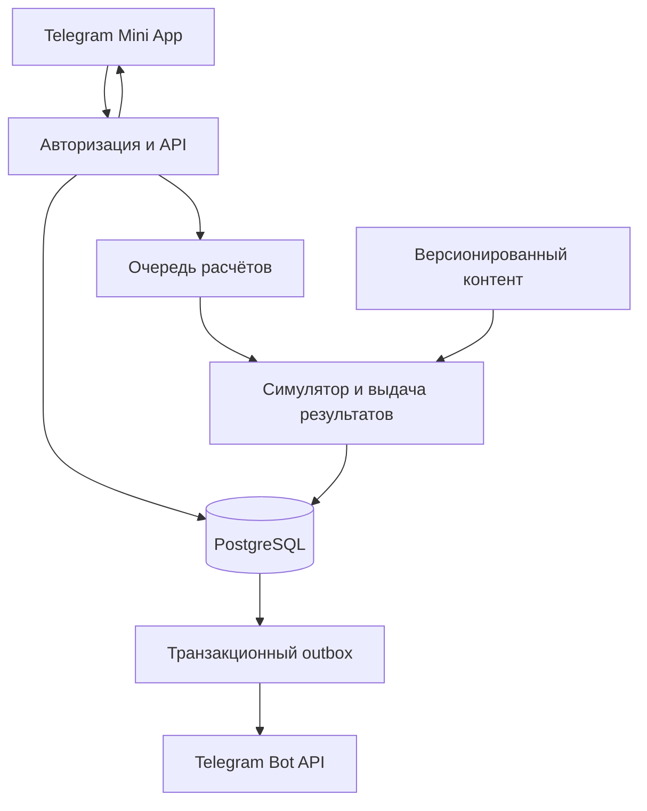

# 06. Техническое устройство

## Решение

Игра представляет собой Telegram Mini App с серверной симуляцией. Клиент показывает состояние и отправляет намерения. Он не определяет время добычи, исходы боёв, стоимость улучшения и рейтинговые результаты.

Начальная архитектура: модульное серверное приложение и отдельный процесс обработки задач из того же репозитория. Разделять её на микросервисы до измеренной необходимости не нужно.

| Слой | Предлагаемый инструмент | Причина |
|---|---|---|
| Интерфейс | TypeScript, React, Vite | Экранные формы, доступность, быстрый цикл разработки |
| Сцена боя | PixiJS | Зрелый 2D-рендерер, атласы, ограниченные эффекты |
| Telegram | Официальный WebApp JS API через небольшой адаптер | Явные проверки доступности функций и минимум зависимости от обёрток |
| API | Node.js LTS, TypeScript, Fastify | Общие типы контента и команд, небольшой серверный слой |
| Данные | PostgreSQL | Транзакции для инвентаря, валют, заказов и рейтингов |
| Фоновая обработка | Задания в PostgreSQL, например pg-boss после оценки | Начало без дополнительной обязательной БД |
| Контент | Версионированные JSON-схемы, проверяемые Zod | Поведение задаётся проверяемыми данными |
| Тестирование | Vitest, Playwright, нагрузочный инструмент k6 | Логика, интерфейс и стоимость автономных расчётов |
| Доставка | HTTPS, объектное хранилище, CDN | Небольшая первичная загрузка и независимые ассеты |

Это предлагаемый стек, зависимости ещё не установлены. PixiJS отвечает за отрисовку, не за честность и правила боя. Специализированный симулятор необходим для оригинальных правил игры; физический движок здесь не требуется.

Redis, постоянные WebSocket-соединения, отдельный поисковый движок и Kubernetes не обязательны в первой версии. Обычный HTTP и ограниченное обновление состояния достаточно; дополнительный транспорт для чата выбирается после измерения задержек.

## Поток данных

## Авторизация

Клиент передаёт исходную строку `Telegram.WebApp.initData` по HTTPS. Сервер проверяет подпись по официальному алгоритму, исключение служебных полей и канонизацию параметров, сравнивает подпись безопасным способом и проверяет `auth_date`. При реализации алгоритм переносится из актуальной документации целиком, без самодельного варианта.

Для первого обмена проектный предел свежести `auth_date` составляет 5 минут с небольшим разрешённым рассогласованием часов. После проверки выдаётся ограниченная сессия. Повторный обмен того же валидного запуска допускается идемпотентно в коротком окне, но не создаёт нового аккаунта или наград. Сессии имеют срок действия и отзыв; долго открытая Mini App обновляет собственную сессию, а не полагается на бессрочную свежесть исходной строки.

`initDataUnsafe`, имя пользователя, переданный с клиента ID, GET-параметры и deep link не являются доказательством личности или прав. Идентификатор аккаунта связан с проверенным Telegram user ID, который хранится как 64-битное значение, не как 32-битный integer. Секрет бота хранится только на сервере.

Настройки внешнего вида можно кешировать на устройстве. Облачное или локальное хранилище Telegram не является источником истины для прогресса. Режим браузерного демо допускается только с отдельными тестовыми аккаунтами и без производственной экономики.

## Контракт автономного расчёта

Сохраняются `last_simulated_at`, `autonomy_until`, снимок билда, версия баланса, текущее состояние боя, индекс случайного потока, выбранный маршрут и правила перехода. Случайный seed генерирует сервер. Частота запросов не создаёт новые seed.

1. Сервер определяет `target_time = min(server_now, autonomy_until)` для уже прошедшего периода.
2. Под блокировкой состояния героя рассчитывает события до этого времени или до границы технического пакета.
3. В одной транзакции сохраняет результат, выдаёт ресурсы и продвигает курсор расчёта. У каждого пакета уникальный ключ `(hero_id, from_cursor, to_cursor, simulation_version)`.
4. Повтор того же задания возвращает сохранённый результат. Падение до commit не выдаёт наград; падение после commit не повторяет выдачу.
5. Возвращение после отдыха сначала завершает старый оплачиваемый временем отрезок, затем переносит начало нового отрезка на текущее время и устанавливает новый горизонт. Пропущенный промежуток не симулируется ради наград.

Продление автономности до `server_now + 48h` разрешено только после фиксации прежнего горизонта и разрыва отдыха, если он был. Иначе вход после недели отсутствия ошибочно оплатил бы всю неделю.

Команда изменения билда сначала завершает расчёт до момента её принятия сервером и становится в очередь на ближайшую границу боя. Нельзя сначала надеть сильную вещь, затем пересчитать прошлые двое суток с ней. Аналогично применяются улучшения слотов, новый маршрут и рост характеристик при повышении уровня.

Инвариант разбиения: `settle(24h)` равен 24 последовательным `settle(1h)` при одинаковых входных условиях. Требуется равенство кошелька, предметов, опыта, RNG-курсора и текущего боя, а не только среднего дохода.

## Производительность симулятора

Логическое время боя дискретно по 100 мс, но процесс не обязан просыпаться каждые 100 мс. Симулятор переходит к следующему значимому событию: готовности атаки, окончанию эффекта, применению навыка или смерти. Он сохраняет тот же порядок разрешения совпавших событий.

Активный бой клиента является воспроизведением серверных событий. Закрытый клиент не обслуживается постоянным процессом. Длинный расчёт делится на возобновляемые пакеты; API возвращает job ID и состояние «рассчитывается», если не укладывается в короткий бюджет. Клиент не позволяет тратить ещё не зафиксированную награду.

Приоритет производительности: добиться точного и достаточно быстрого расчёта 48 часов на эталонном наборе. Агрегирование повторяющихся боёв разрешено только при доказанном равенстве полного состояния, включая предметы, RNG-последовательность и события повышения уровня. Подмена реальных боёв формулой «сила x время» не соответствует дизайну.

Нужно измерять CPU-ms на час пути, p95 длительности возвращения и стоимость на DAU. Первая нагрузочная гипотеза: 10 000 DAU, 2 возвращения в сутки дают в среднем 0.23 длинного расчёта/с, но пик может быть в 20 раз выше. Если один возврат занимает 2 CPU-секунды, это примерно 0.46 CPU-ядра в среднем и 9.3 на таком пике только для симуляций. Эти числа показывают зависимость стоимости, а не обещают достаточность конкретного сервера.

## Хранимые сущности

| Группа | Сущности и обязательные свойства |
|---|---|
| Аккаунт | Account, TelegramIdentity, Session, PrivacySettings, BlockList |
| Герой | Hero, BuildPreset, EquippedSlot, SlotUpgrade, ActiveJourney, BattleState |
| Предметы | ItemInstance, ItemDefinition, InventoryLocation, ProtectedItem, CraftProgress |
| Экономика | Wallet, WalletLedger, RewardGrant, EconomyVersion |
| Социальные | Clan, MembershipHistory, ClanRole, WeeklyRoster, ClanTask, ClanAttempt |
| Рейтинги | Season, ChallengeDefinition, Attempt, ScoreEntry, RewardEntitlement |
| Платежи | Order, TelegramPayment, CosmeticEntitlement, Refund |
| Эксплуатация | SimulationJob, ContentVersion, AuditEvent, OutboxEvent, ModerationCase |

Кошелёк и изменение вещей обновляются транзакционно. Материалы и монеты целочисленные. Одна вещь не может одновременно быть разобрана и надета. Вещи активного, ожидающего и сохранённых пресетов защищены от авторазбора; ручной разбор возможен только после удаления ссылок на вещь и повторной проверки очереди билда. Расходы используют ограничения БД и актуальную версию состояния. Для конкурентных запросов предусмотрены идемпотентный command ID и проверка revision.

Журнал ресурсов хранит источник, получателя, величину, версию контента и causation ID. Полный покадровый журнал всех обычных боёв не сохраняется бесконечно: достаточно контрольных состояний, агрегатов и ограниченного окна подробной диагностики. Рейтинговые попытки сохраняют входы для серверного воспроизведения.

## Набор команд API

| Команда | Серверная обязанность |
|---|---|
| `POST /auth/telegram` | Проверить initData, выдать сессию |
| `GET /state` | Вернуть ревизию, состояние и статус расчёта |
| `POST /journey/settle` | Идемпотентно рассчитать прошлое время |
| `POST /journey/plan` | Проверить открытые маршруты, применить будущий план |
| `POST /build/apply` | Проверить владение, навыки и границу боя |
| `POST /items/dismantle` | Проверить защиту и экипировку, выдать материал один раз |
| `POST /slots/upgrade` | Проверить cap, цену, ресурсы и revision |
| `POST /craft/commit` | Проверить рецепт, гарант и стоимость |
| `POST /challenge/attempts` | Зафиксировать снимок, seed и допустимое число попыток |
| `POST /clans/join` | Проверить приглашение и права недельного участия |
| `POST /payments/invoice` | Создать заказ из серверного каталога |
| `POST /telegram/webhook` | Проверить доставку Telegram, обработать повтор безопасно |

Названия описывают будущий контракт, endpoints ещё не реализованы. Получение публичного рейтинга не обязано запускать расчёт личного пути. Частота команд ограничивается по аккаунту и источнику; смена IP не обходит лимиты аккаунта.

## Баланс, сезоны и обновления

Начавшийся бой заканчивается на своей версии правил. Длительный период пересекает обновление по заранее зафиксированному времени активации: часть до него рассчитывается старой версией, часть после него новой. Старые таблицы остаются доступны как минимум на максимальный горизонт автономности и период воспроизведения спорных результатов.

Обычные изменения не меняют уже выпавшие свойства молча. Для миграции предметов нужен отдельный версионированный сценарий и уведомление. Исправление эксплойта может временно остановить затронутый режим, не всю игру.

Рейтинговое испытание закрепляет версию на весь срок. При критическом нарушении честности испытание аннулируется для всех с одинаковым правилом компенсации; точечный патч посреди единой таблицы результатов запрещён. Окончательная награда рассчитывается из закрытого периода и выдаётся с уникальным entitlement ID.

## Telegram и покупки

Доступ: Main Mini App в профиле бота, кнопка меню и deep links с `startapp`. Параметр ссылки содержит короткий ограниченный идентификатор, проверяемый на сервере; не код, цену или права на клан. Приглашение имеет срок и проверку доступности места.

Клиент вызывает `ready()` после появления рабочего первого экрана, учитывает `viewportStableHeight`, safe area и content safe area. Новые возможности вызываются только после проверки версии/наличия. Полноэкранность и блокировка ориентации не являются условием работоспособности.

Цифровые покупки внутри Telegram: Stars, код валюты `XTR`. Цена и описание приходят из серверного каталога. Подтверждение `pre_checkout_query` не выдаёт товар. Косметика начисляется только по проверенному `successful_payment` с уникальным `telegram_payment_charge_id`; повтор webhook не повторяет покупку.

Webhook проверяет секрет доставки, а заказ сверяет аккаунт, валюту, сумму, payload и статус. Чужая или просроченная заявка не создаёт entitlement. Возврат через `refundStarPayment` отражается в журнале; отозванную косметику снимают с экипировки, не затрагивая боевые ресурсы. Нужны `/paysupport`, доступная поддержка, правила покупки и возврата. До запуска используются тестовые платежи.

## Надёжность и эксплуатация

Ежедневные резервные копии дополняются журналом для восстановления на момент времени. Целевые RPO не более 15 минут, RTO не более 4 часов; они подтверждаются учебным восстановлением до платного запуска. Копия без проверки восстановления не считается готовностью.

Наблюдаемость: длительность расчётов, размер очереди, ошибки команд, отрицательные балансы, повторные выдачи, платежи без товара, скорость изменения рейтинга и отказ клиента. Админ-панель показывает причинную цепочку наград; ручное исправление требует основания и журналируется.

Приватность: не запрашивать номер телефона, контакты или местоположение ради игры. Публичный профиль использует игровой псевдоним; Telegram username не публикуется автоматически. Предусмотреть удаление аккаунта, сроки хранения сообщений и законно необходимых платёжных записей. Конкретную политику хранения уточнить перед релизом под выбранную юрисдикцию.

## Проверенные внешние ограничения

Официальные источники прочитаны 8 сентября 2026 года:

- [Telegram Mini Apps](https://core.telegram.org/bots/webapps): проверка `initData`, недоверие к `initDataUnsafe`, параметры запуска, viewport, safe area и доступные API.
- [Telegram Stars: digital goods](https://core.telegram.org/bots/payments-stars): цифровые товары в Stars, `XTR`, выдача после `successful_payment`, поддержка и возвраты.
- [Bot API](https://core.telegram.org/bots/api): справочник методов для проверки деталей непосредственно перед реализацией.

Свежесть подписи, сроки собственной сессии, лимиты команд и выбранная серверная архитектура являются решениями проекта, а не требованиями Telegram. Возможности на Android, iOS и Desktop проверяются на реальных клиентах до релиза.
